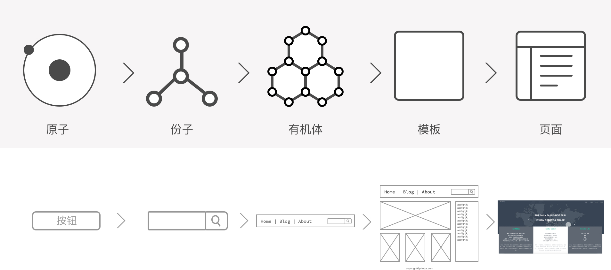
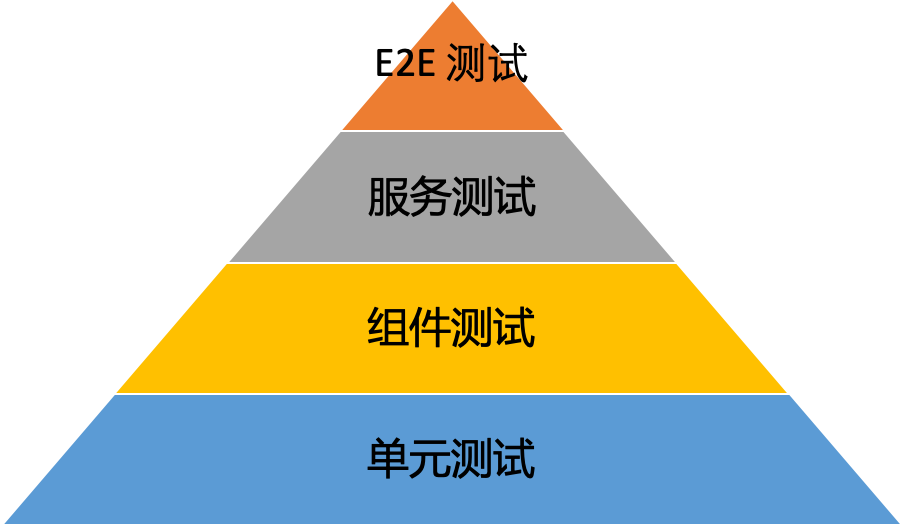

# 前端体系规划指南

欢迎在 issue 中留下你的相关建议。

原则：

 1. Reusable （包含可重用 UI 设计）
 2. Responsive（快速发布周期）
 3. Quality （质量控制）
 4. Cross-Platform 跨平台（响应式设计，混合应用）
 5. Communication（减少沟通成本，UX 和开发）
 
## 1. 设计

### 原型

> 原型，是指某种新技术在投入量产之前的所作的模型，用以检测产品质量，保障正常运行。

分类：

 - **验证原型** 用于验证最初设计的一些关键功能，没有最终产品的所有功能。
 - **工作原型** 最终产品所有的或几乎所有的功能。
 - **视觉原型** 预期设计的尺寸和外观，而不是功能。
 - **形态原型** 是初期的视觉原型，强调其中设计的几何特征，不是很重视颜色，纹理，或其他与最终外观相关的属性。
 - **使用者体验原型** 在功能与外观上相当完整的原型，可以用于使用者研究。
 - **功能原型** 完成设计上所要求的功能和外观，但可能是与最终设计使用不同的技术和不同的尺寸来创建。
 - **纸上原型** 印刷的或手绘的软件产品之使用者界面。这些原型通常用于设计软件时，在早期的设计阶段时进行软件功能盘点，以便在投入更多耗费成本的设计之前，先确认设计决策是否正确。

相关工具：

 - Balsamiq Mockups
 - Axure
 - Sketch

相关文章：

 - [The Front-End Design Checklist](https://codeburst.io/the-front-end-design-checklist-4dd15828fad)
 - [How to write a good software design doc](https://medium.freecodecamp.org/how-to-write-a-good-software-design-document-66fcf019569c)

### 设计系统（Design System）

目的（Why）：

> **设计系统**是一组相互关联的设计模式与共同实践的，以连贯组织来达成数字产品的目的。模式是重复组合以创建界面的元素：用户流、交互、按钮、文本、图标，颜色、排版、微观等。实践则是选择创建，捕获，共享和使用这些模式的方法，特别是在团队中工作时。 —— Alla Kholmatova 《Design Systems》

如何做：

 - [Design Systems at GitHub](https://medium.com/@broccolini/design-systems-at-github-c8e5378d2542)

示例：

 - [Material Design](https://material.io/design/)
 - [Ant Design](https://ant.design/)

相关模式：

 - **原子设计**，是一个设计方法论，由五种不同的阶段组合，它们协同工作，以创建一个有层次、计划性的方式来界面系统。

相关文章：

 - [What is a Design System?](https://medium.muz.li/what-is-a-design-system-1e43d19e7696)
 - [Atomic Design](http://atomicdesign.bradfrost.com/table-of-contents/)

### Design System Ops

> **Design System Ops**，允许整个组织的人员设计、重新设计和改进产品，而不会失去质量，可用性和一致性。

相关文章：

 - [DesignOps at Airbnb: How we manage effective design at scale](https://airbnb.design/designops-airbnb/)
 - [DesignOps: Unleashing the potential of our design studio](https://www.atlassian.com/blog/inside-atlassian/designops-atlassian-design-studio)
 - [What is design operations and why should you care?](https://medium.com/designer-hangout/what-is-design-operations-and-why-should-you-care-b72f02b47761)

### 可视化搭建前端

> 可视化搭建前端，是指通过推拽的方式，在线创建和生成前端界面。

示例：

 - [飞冰](https://github.com/alibaba/ice) 是一套综合解决方案，用来极速构建中后台应用。

相关文章：

### 架构

普通相关资源：

 - [zoid](https://github.com/krakenjs/zoid) 跨域组件工具集
 - [post-robot](https://github.com/krakenjs/post-robot)  客户端跨域 post-messaging 
 - [Resources about Front-end Architecture and Design Systems, etc.](https://notlaura.com/resources-about-front-end-architecture-and-design-systems-etc/)
 - [AWS Architect Patterns Archives](http://www.dcsolutionfactory.ca/dcsf/aws-patterns/)

微前端相关资源：

 - [Mooa](https://github.com/phodal/mooa) Angular 微前端框架
 - [single-spa](https://github.com/CanopyTax/single-spa) 跨前端工具集
 - [Stencil](https://stenciljs.com/) 跨前端框架组件库

相关文章：

 - [Scalable Frontend #2 — Common Patterns](https://blog.codeminer42.com/scalable-frontend-2-common-patterns-d2f28aef0714)

## 2. 创建

### 脚手架/生成器

>  **脚手架**。作为一个基础的模块应用，用于快速生成、搭建前端应用。它除了包含一个前端项目所需要的要素，往往还包含着组织内部相关的规范和模式，如部署模板、构建系统等。

类型：

 - GUI 脚手架。
 - CLI 脚手架。

> **生成器**，可以根据一系列的配置参数，以实现更强的定制化作用。它是一种更高级的脚手架的方式来创建应用。

相关文章：

 - [How to build your own React boilerplate](https://medium.freecodecamp.org/how-to-build-your-own-react-boilerplate-2f8cbbeb9b3f)

### 快速工作平台

Why：搭建环境不是一件容易的事。

>

How：通过 CLI 生成。

## 3. 开发 

### 代码模式库

> 模式库，是一系列可复用代码的合集，如前端的组件，通用的工具函数等等。其目的是在多个应用之间共享代码，以降低修改成本。在设计架构的时候，要是考虑内建相应的 UI 组件库，便需要考虑结合装饰器模式，作为一层代理，来封装外部的 API，以降低后期的修改成本。它还包含了用于多个前端应用通讯的**数据通讯**库。

相关资源：[Vanilla.js Boilerplates](https://vanillajstoolkit.com/boilerplates/)

相关文章：
 
 - [Creating your own vanilla JS helper library like Lodash and Underscore.js](https://gomakethings.com/creating-your-own-vanilla-js-helper-library-like-lodash-and-underscore.js/)
 - [How to create your own vanilla JS DOM manipulation library like jQuery](https://gomakethings.com/how-to-create-your-own-vanilla-js-dom-manipulation-library-like-jquery/)

### Mock Server

Why：

> Mock Server（仿造服务器），即用于仿造后端接口的模拟 HTTP 服务器。它是一个简单的 HTTP 服务，在后端未准备好的情况下，它可以为前端提供一个可用的 API 服务。

模式：

 - **普通 Mock Server**。在 API 配置文件中定义了什么，便返回什么内容。
 - **DSL 形式的 Mock Server**。它是以普通的 Mock Server 有所不同，其中的配置文件（通常是 JSON）是通过特定格式编写的，返回的数据只是 API 配置的一部分。
 - **编程型 Mock Server**。它需要我们编写简单的代码，才能返回对应的 API 数据。它的优点是灵活性更高，但是缺点便是维护成本更高。
 - **契约测试**，又称之为消费者驱动的契约测试（Consumer-Driven Contracts，简称 CDC），是指从消费者业务实现的角度出发，驱动出契约，再基于契约，对提供者验证的一种测试方式。

相关资源：

 - [Faker.js](https://github.com/marak/Faker.js/)
 - [Swagger](https://github.com/swagger-api/swagger-ui)
 - [Moco](https://github.com/dreamhead/moco)

### 编辑器/IDE 插件

> 编辑器/IDE 插件，用于在 IDE/编辑器插件中，集成文档、常用代码等相关内容。

Intellij IDEA 相关资源：

 - [Creating Your First Plugin](http://www.jetbrains.org/intellij/sdk/docs/basics/getting_started.html)
 - [Creating a Plugin Project](https://www.jetbrains.org/intellij/sdk/docs/basics/getting_started/creating_plugin_project.html)

 VisualCode Studio 相关资源：

  - [Your First Extension](https://code.visualstudio.com/api/get-started/your-first-extension)
  - [Snippet Guide](https://code.visualstudio.com/api/language-extensions/snippet-guide)

### 浏览器插件

相关插件类型：

 - Developer Tools.
 - API 验证。诸如 Postman
 
### 调试 Debug 工具

代理调试：不管是在开发过程中，还是实际的线上 Debug 中，都需要查看、修改 HTTP/HTTPS、WebSocket 的请求、响应，同时也需要 HTTP/HTTPS 代理服务，把实际的域名，代理到本地测试服务器用于调试。

相关工具：

 - [Whistle](https://wproxy.org/whistle/)
 - [Charles](https://www.charlesproxy.com/)
 - [Fiddler](https://www.telerik.com/fiddler)

移动端调试：在 APP 中或者在移动浏览器调试网页，没有类似 Chrome Developer Tools 的调试工具，无法方便的查看请求，打印到 Console 等常规调试方法。

相关工具：

 - [vConsole](https://github.com/Tencent/vConsole)
 - [eruda](https://github.com/liriliri/eruda)

### 性能分析与优化

检查清单：

 - [Front-End Performance Checklist](https://github.com/thedaviddias/Front-End-Performance-Checklist)

要点：

 - TTFB （Time to first byte）时间

相关工具：
 
 - Chrome Lighthouse/Audits （Chrome Developer Tools 的 Audits 标签里）

常规优化：

 - [Essential Image Optimization](https://images.guide/) 图片优化完全指南。
 - [前端性能量化标准](https://github.com/frontend9/fe9-library/issues/7)
 - [前端性能优化の备忘录](https://www.w3ctech.com/topic/2089)
 - [如何使用 Timeline 工具](https://developers.google.com/web/tools/chrome-devtools/evaluate-performance/timeline-tool?hl=zh-cn) Google 官方的 Timeline API 使用。
 - [7 天打造前端性能监控系统](http://fex.baidu.com/blog/2014/05/build-performance-monitor-in-7-days/)。来自百度 FEX 的文章，从 What、How、What 等几个维度，详细介绍了 Web 前端性能优化。
 - 中文版：[2018 前端性能优化清单](https://github.com/xitu/gold-miner/blob/master/TODO/front-end-performance-checklist-2018-4.md)
 - [Lighthouse 与 Google 的移动端最佳实践](https://juejin.im/post/5a7ec3eaf265da4e9449af03)

企业级相关文章：

 - [Case study: analyzing the Walmart site performance](https://iamakulov.com/notes/walmart/)
 - [A Tinder Progressive Web App Performance Case Study](https://medium.com/@addyosmani/a-tinder-progressive-web-app-performance-case-study-78919d98ece0)
 - [A Pinterest Progressive Web App Performance Case Study](https://medium.com/dev-channel/a-pinterest-progressive-web-app-performance-case-study-3bd6ed2e6154)
 - [Twitter Lite and High Performance React Progressive Web Apps at Scale](https://medium.com/@paularmstrong/twitter-lite-and-high-performance-react-progressive-web-apps-at-scale-d28a00e780a3)

构建时优化：

 - [Keep webpack Fast: A Field Guide for Better Build Performance](https://slack.engineering/keep-webpack-fast-a-field-guide-for-better-build-performance-f56a5995e8f1)

## 4. 联调

### 统一 API 接口

Why: 后端设计的接口，并不一定适用于前端使用。这便要求前端对后端有一定的了解，以协助后端设计出适合前端使用的 API。

> 

相关资源：

 - [Shopify GraphQL Design Tutorial](https://github.com/Shopify/graphql-design-tutorial/blob/master/TUTORIAL.md)
 - [RESTful API Design Tips from Experience](https://medium.com/studioarmix/learn-restful-api-design-ideals-c5ec915a430f)

### 自动化契约测试

Why: 在实施前后端分离架构的过程中，最让人苦恼的莫过于：API 发生了变化。API 发生变化的原因那可是相当的丰富：业务变化、字段名出错、第三方接口不匹配等等。

> 契约测试，又称之为**消费者驱动的契约测试**(Consumer-Driven Contracts，简称CDC)，根据消费者驱动契约，我们可以将服务分为消费者端和生产者端，而消费者驱动的契约测试的核心思想在于：从消费者业务实现的角度出发，由消费者自己会定义需要的数据格式以及交互细节，并驱动生成一份契约文件。然后生产者根据契约文件来实现自己的逻辑，并在持续集成环境中持续验证。

相关资源：

 - [前后端分离：使用 mest 做契约测试跟踪 API 接口变更](https://www.phodal.com/blog/frontend-contract-test-use-mest-way/)
 - [服务下的契约测试 (CDC) 解读](https://testerhome.com/topics/10806)

## 5. 测试

### 前端测试

相关资源：

 - [Covering A/B tests with UI tests: How to avoid getting tangled up in your own code](https://badootech.badoo.com/covering-ab-tests-with-ui-testing-1df5401ff0e1)

### 性能测试

相关文章：

 - [前端性能优化之性能测试](https://juejin.im/post/5a41abb35188252a3d383eb8)
 - [Getting Up To Speed With High Performance Web](https://blog.prototypr.io/getting-up-to-speed-with-high-performance-web-58b740042892)

### 可视化回归测试

> 可视化回归测试工具，通过捕获网页 /UI的屏幕截图，并将其与原始图像（历史基线屏幕截图或来自实时网站的参考图像）进行比较，来执行前端或用户界面（UI）回归测试。

相关 Awesome 资源：[Awesome Visual Regression Testing](https://github.com/mojoaxel/awesome-regression-testing)

相关工具：

 - snapshot testing

## 6. 运营

### 应用性能监测

> APM （Application Performance Management，即应用性能管理，在分布式领域也称为分布式跟踪管理）对企业的应用系统进行实时监控，它是用于实现对应用程序性能管理和故障管理的系统化的解决方案。

相关资源：

 - [Pinpoint](https://github.com/naver/pinpoint)

相关文章：
 
 - [Browser Monitoring for GitHub.com](https://github.blog/2015-05-19-browser-monitoring-for-github-com/)

### 错误日志跟踪

> 有很多种情况会导致Javascript抛出异常，包括网络失效、语法错误、运行时错误等。我们希望在页面上有异常发生时，能够获得脚本错误的基本信息、文件url、行号 。

How：

相关文章：

 - [Capture and report JavaScript errors with window.onerror](https://blog.sentry.io/2016/01/04/client-javascript-reporting-window-onerror)
 - [前端异常监控系统的落地](https://zhuanlan.zhihu.com/p/26085642)
 - [前端代码异常监控实战](https://github.com/happylindz/blog/issues/5)

相关资源：

 - [BetterJS](https://github.com/BetterJS) 是一个 Web 前端脚本错误监控及跟踪解决方案。该项目为鹅厂 imweb 团队的开源项目。
 - [badjs2](https://github.com/iv-web/badjs2) 是一个前端脚本错误监控及跟踪解决方案。
 - [Sentry](https://github.com/getsentry/sentry)

## 7. 维护？（待定）

### 架构迁移

相关文章：

 - [Rearchitecting Airbnb’s Frontend](https://medium.com/airbnb-engineering/rearchitecting-airbnbs-frontend-5e213efc24d2)
 - [Moving Airbnb Search to React](https://medium.com/airbnb-engineering/moving-airbnb-search-to-react-b85b815e166c)

### 重写

## 其它 

### 相关文章

**效能**：

 - [十倍效能提升——Web 基础研发体系的建立](http://www.cnblogs.com/sskyy/p/8613393.html)

**度量**

 - [如何衡量研发效能？阿里资深技术专家提出了5组指标](https://yq.aliyun.com/articles/690725)。关键字：持续发布能力、需求响应周期、交付吞吐率、交付过程质量、对外交付质量。

### 相关资源

### AlloyTeam

来源：[https://github.com/Pines-Cheng/think/issues/32](https://github.com/Pines-Cheng/think/issues/32)

AlloyTeam 内部都有对应的解决方案：

 - Steamer 命令行工具及脚手架
 - AlloyStore 组件展示平台
 - LinkStar 假数据联调平台
 - JB 测试部署平台
 - Ars 发布上线平台
 - AlloyData 数据上报平台
 - Sentry 错误监控平台
 - AlloyKit 离线包发布平台
 - XuanWu 直出平台

### Frontend Case Stuies

** [https://github.com/andrew--r/frontend-case-studies](https://github.com/andrew--r/frontend-case-studies) 这个项目介绍了真实世界的企业前端架构，包含了一系列的相关案例。

***** [卫报 前端文档](https://github.com/guardian/frontend/tree/master/docs) 该项目不仅包含了卫报的前端代码，以及相关的详细设计文档。

License
---

© 2019 A [Phodal Huang](https://www.phodal.com)'s [Idea](http://github.com/phodal/ideas).  This code is distributed under the MIT license. See `LICENSE` in this directory.
