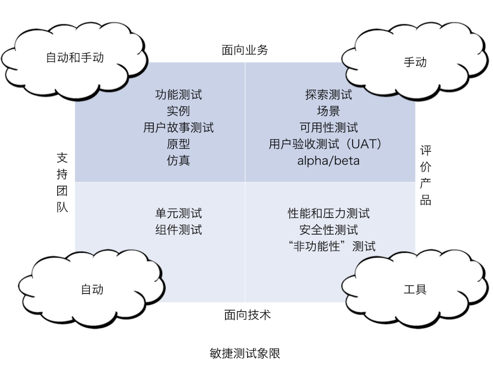

# 前端效能评估

原则：

1. 可视化。
2. 流动。
3. 持续改进。

实施要点：

1. 全流程 DevOps
2. 跨职能团队

参考：微服务 12 要素：[Twelve-Factor App](https://12factor.net/zh_cn/)

难点：

1. 如何度量？

## Stage

| 阶段    |  痛点           |     提升         |
|---------|----------------|-----------------|
| 设计    |
| 创建    |
| 研发    |
| 测试    |
| 发布    |
| 分析    |
| 运营    |

### Stage 规范

stage 1：建立代码共享机制

stage 2：流程自动化

stage 3：低代码编程

### Stage 描述

**Stage 1 架构示例**

Stage 1 用户场景

**Stage 2 架构示例**

Stage 1 用户场景

**Stage 3 架构示例**

Stage 1 用户场景

### 前端成熟度模型

## 设计

痛点：

 - 风格不一致
 - 缺乏架构经验

提升：

 - 风格指南（Style Guide）
 - 设计系统（原子设计）
 - 原型设计（MVP）
 - 架构概念验证
 - 架构知识库
 - 架构守护（前端架构守护？？）

阶段产出物：

1. 系统架构
2. MVP 原型

组织设计体系（来自《精益创业：UX 篇》）：风格指南、品牌指南、模式库、组件库。目的：提升一致性、提升质量、降低成本。

## 创建

痛点：

 - 创建速度慢

提升：

 - 应用脚手架（S1：固定模板脚手架，S2：CLI 配置生成，S3：GUI/CLI 全生命周期管理）

## 研发

痛点：
 
 - 开发效率低
 - 代码风格不一致

提升：

 - 技术培训
 - 知识共享
 - 文档化（Stage 1：在线 Wiki，Stage 2：工具（插件）即文档）
 - 

## 测试

Brian Marick 的敏捷测试四象限

痛点：
 
 - 搭建慢

提升：

 - UI 测试自动化

维度：

1. 提交前测试
2. 预发现测试
3. 性能测试
4. 用户验证测试

## 发布

痛点：

 - 重复搭建

提升：

 - 示例模板

## 分析

痛点：

 - 手动埋点

提升： 

 - 

## 运营

痛点：

 - 

提升：

 - 灰度测试

## 其它

### 效能度量

BUG 自动化分析、归类系统

